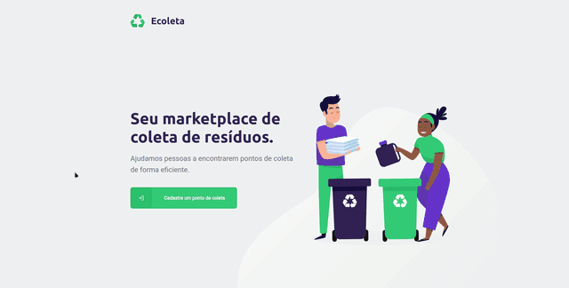

<div align="center">
    
    <h3 align="center">Ajudando você a reciclar e salvar o meio ambiente</h3>
    <br/>
</div>

# Índice

- [Sobre](#sobre)
- [Tecnologias Utilizadas](#tecnologias-utilizadas)
- [Overview das Aplicações](#overview)
- [Executando o Projeto](#executando)
  - [Iniciando o Backend](#backend)
  - [Iniciando o Frontend](#frontend)
  - [Iniciando o Mobile](#Mobile)

<br/>
<a id="sobre"></a>

## :scroll: Sobre

O projeto **Ecoleta** é uma ideia de facilitar o descarte e coleta de items reciclavéis. Conectando a empresa de coleta ao usuário, através de uma aplicação **Web**, para o cadastro da empresa, e **Mobile**, para a consulta do usuário

A ideia foi desenvolvida pela :rocket: [Rocketseat](https://rocketseat.com.br/) e colocada em prática na **NLW - NextLevelWeek**


<br/>
<a id="tecnologias-utilizadas"></a>

## :wrench: Tecnologias Utilizadas

Esse projeto foi desenvolvido com a seguinte Stack

- [TypeScript](https://www.typescriptlang.org/)
- [Node.js](https://nodejs.org/en/)
- [ReactJS](https://reactjs.org/)
- [React Native](https://reactnative.dev/)


<br/>
<a id="overview"></a>

## :mag: Overview das Aplicações

**Podemos ver abaixo o resultado das aplicações Web e Mobile**

- Ecoleta Web - Versão com o intuito de realizar o cadastro de oontos de coleta, de acordo com a localização

<h1 align="center">
    
</h1>

- Ecoleta Mobile: A versão mobile foi feita pensando no usuário que deseja reciclar items, mas não sabe os pontos próximos que realizam essa coleta

<h1 align="center">
    
</h1>


<br/>
<a id="executando"></a>

## :rocket: Executando o Projeto

- ### **Pré-requisitos**

  - **Git**
  - **Node.js**
  - **NPM**
  - **Expo**

### **Faça o download do Projeto**

```sh
  $ git clone https://github.com/ErickCamara/Ecoleta.git
```

<br/>
<a id="backend"></a>


### :floppy_disk: **Iniciando o Backend**

O Backend deverá ser o primeiro a ser iniciado pois tanto o Aplicativo Web quanto o Mobile dependem dele para realizar a consulta dos dados

- Acesse a pasta server
```sh
  $ cd server
```
- Instale as depêndecias do Backend
```sh
  $ npm install
```
- Já existem um banco de dados SQLite criado, mas caso deseje um banco zerado execute os comandos abaixo dentro da pasta **server**
```sh
  $ rm -rf src/database/database.sqlite
  $ npm run knex:migrate
  $ npm run knex:seed
```
- Inicie a API
```sh
  $ npm run dev
```

<br/>
<a id="frontend"></a>

### :computer: **Iniciando o Frontend**

Para iniciar o Frontend é bem simples:

- Acesse a pasta web e execute
```sh
  $ cd web
  $ npm start
```
- Será aberta uma nova aba no seu navegador com a aplicação rodando
- Caso a aba não abra basta acessar a url: http://127.0.0.1:3000

<br/>

:bulb: ***Caso ocorra algum erro de depêndencia basta executar o seguinte comando dentro da pasta web:***
```sh
  $ npm install
```
- Se o problema persisir basta verificar as dependências utilizadas na aplicação abrindo arquivo **package.json** e instalando as aplicações que estejam faltando com o seguinte comando:
```sh
  $ npm install <NOME-DA-DEPENDENCIA>
```

<br/>
<a id="mobile"></a>

### :iphone: **Iniciando o Mobile**

Para executar o aplicativo diretamente no seu celular é necessário ter o aplicativo **Expo** instalado. Caso você ainda não tenha, baixe o mesmo antes de continuar

- Acesse a pasta mobile
```sh
  $ cd mobile
```
- Execute o comando
```sh
  $ Expo Start
```
- Em seguida será aberto uma nova aba no seu navegador com algumas informações e um QR Code, caso a aba não abra corretamente, verifique seu terminal que no mesmo também terá as mesmas informações.
- Agora abra o Aplicativo do Expo no seu celular
- Clique no botão **Scan QR Code** e seu aplicativo começará a ser carregado

<br/>

:bulb: ***Caso ocorra algum erro de depêndencia basta executar o seguinte comando dentro da pasta mobile:***
```sh
  $ npm install
```
- Se o problema persisir basta verificar as dependências utilizadas na aplicação abrindo arquivo **package.json** e instalando as aplicações que estejam faltando com o seguinte comando:
```sh
  $ npm install <NOME-DA-DEPENDENCIA>
```
